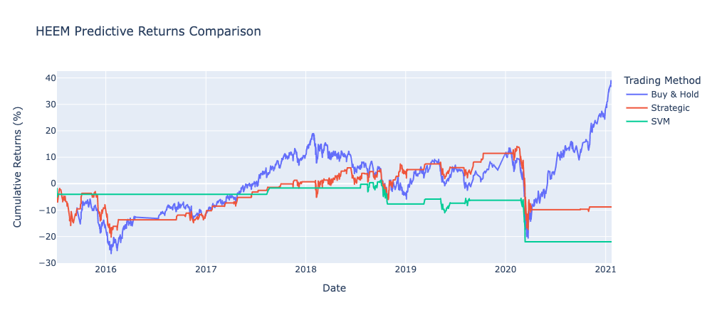

# HEEM Machine Learning Trading Bot

## Summary

This study compares a basic Moving Average Crossover-Divergence (MACD) trading algorithm with a Support Vector Machine (SVM) and a Multi-layer Perceptron (MLP) classifier. The SVM and MLP models are trained using the Fast Simple Moving Average (SMA) and Slow SMA as features with the buy/sell (1 or -1) signal as the target.

## Results

### MACD Strategy

The basic MACD trading strategy buys stock when the Fast SMA crosses above the Slow SMA, and sells when the inverse occurs.

### SVM & MLP

In this trial, the SVM and MLP models underperformed the MACD strategy. This can change with a bit of tuning.

### Different Training Set Durations

A comparison of performance when the size of the training set is changed:

5 Months of training data

10 Months of training data

20 Months of training data

### Different Fast SMA Window

When the Fast SMA is changed from 4 to 15, the SVM yields better results. This changes from trial-to-trial though, so it is not safe to trust the performance of one single trial.

## Conclusion

Taking risk into account, the MACD remains as the most reliable trading strategy aside from the buy-and-hold strategy.