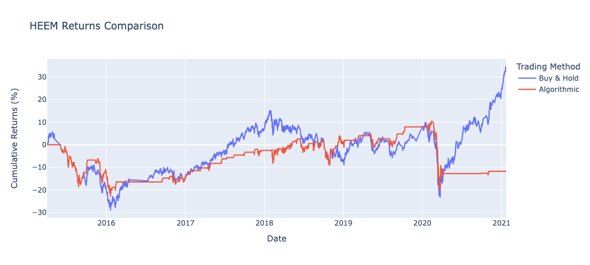
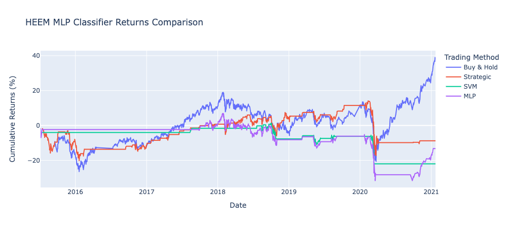
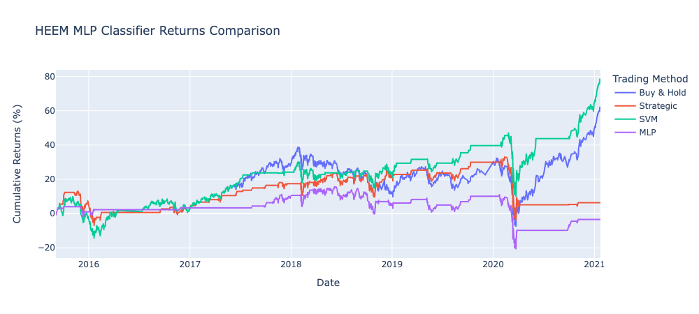
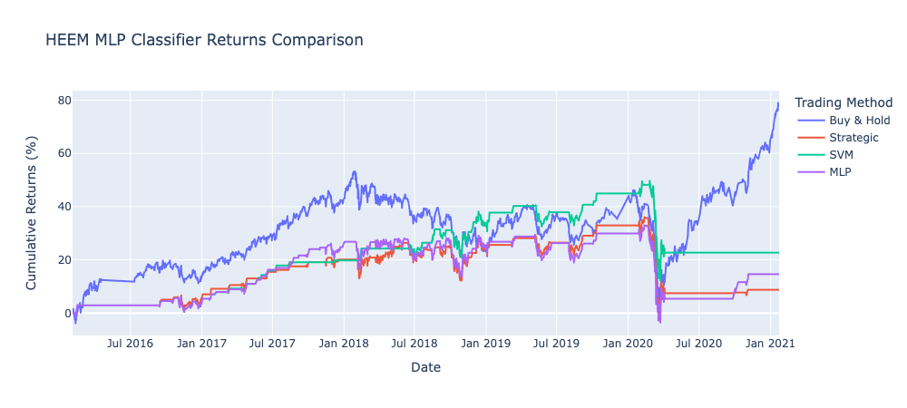
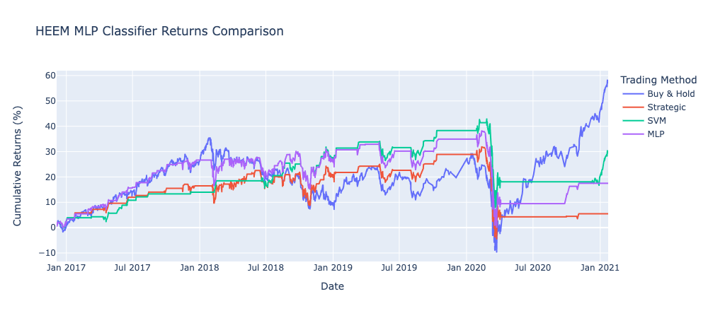
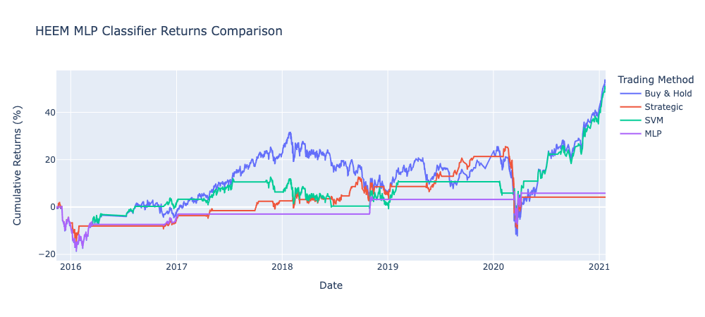

# HEEM Machine Learning Trading Bot

## Summary

This study compares a basic Moving Average Crossover-Divergence (MACD) trading algorithm with a Support Vector Machine (SVM) and a Multi-layer Perceptron (MLP) classifier. The SVM and MLP models are trained using the Fast Simple Moving Average (SMA) and Slow SMA as features with the buy/sell (1 or -1) signal as the target.

## Usage

### Environment

Requires an [Anaconda](https://www.anaconda.com/products/distribution) virtual environment running Python >= 3.7.

Activate your Anaconda virtual environment.
```sh
conda activate <env>
```

### Dependencies

These installations are required to run the analysis. Newer package versions can be used, but be aware that library updates may cause code errors in the notebook.

```sh
pip install numpy==1.20.3
pip install pandas==1.3.4
pip install matplotlib==3.4.3
pip install plotly==5.6.0
pip install scikit-learn==0.24.2
```

### Run

Run the program using your Jupyter Notebook editor of choice.

## Results

### MACD Strategy

The basic MACD trading strategy buys stock when the Fast SMA crosses above the Slow SMA, and sells when the inverse occurs.



### SVM & MLP

In this trial, the SVM and MLP models underperformed the MACD strategy. This can change with a bit of tuning.



### Different Training Set Durations

A comparison of performance when the size of the training set is changed:

5 Months of training data



10 Months of training data



20 Months of training data



### Different Fast SMA Window

When the Fast SMA is changed from 4 to 15, the SVM yields better results. This changes from trial-to-trial though, so it is not safe to trust the performance of one single trial.



## Conclusion

It's hard to trust the SVM model alone since changing feature inputs seems to elicit random results. A solution would be to aggregate the results of many trials to test for reliable performance.